```mermaid
graph TD
    A[Start: send_async_email] --> B[Obtener Notificación y actualizar reintentos];
    B --> C[Renderizar plantilla y preparar parámetros de email];
    C --> D[API Externa: send_email];
    D --> E{¿Envío exitoso?};
    E -- Sí --> F[Marcar Notificación como consumida];
    F --> K[End];
    E -- No --> G{¿Reintentos < Límite?};
    G -- Sí --> H[Re-encolar tarea send_async_email];
    H --> K;
    G -- No --> I[Marcar Notificación como cancelada];
    I --> K;

    subgraph dependencias
        direction LR
        subgraph "API Externa"
            L[app.notification]
        end
        subgraph "ORM"
            M[Notification]
            N[NotificationTemplate]
        end
    end

    B --> M;
    C --> N;
    D --> L;
    F --> M;
    I --> M;
```

```mermaid
graph TD
    A[Start: send_async_sms] --> B[Obtener Notificación y actualizar reintentos];
    B --> C[Renderizar plantilla y preparar parámetros de SMS];
    C --> D[API Externa: send_sms];
    D --> E{¿Envío exitoso?};
    E -- Sí --> F[Marcar Notificación como consumida];
    F --> K[End];
    E -- No --> G{¿Reintentos < Límite?};
    G -- Sí --> H[Re-encolar tarea send_async_sms];
    H --> K;
    G -- No --> I[Marcar Notificación como cancelada];
    I --> K;

    subgraph dependencias
        direction LR
        subgraph "API Externa"
            L[app.notification]
        end
        subgraph "ORM"
            M[Notification]
            N[NotificationTemplate]
        end
    end

    B --> M;
    C --> N;
    D --> L;
    F --> M;
    I --> M;
```

```mermaid
graph TD
    A[Start: import_iccs_from_zipfile] --> B[Descargar ZIP de S3];
    B --> C[Descomprimir ZIP];
    C --> D{Iterar sobre ficheros PDF};
    D -- Para cada PDF --> E[Extraer código ICC];
    E --> F{¿ICC ya existe en BD?};
    F -- No --> G[Crear registro Icc en BD y subir PDF a S3];
    G --> H{¿Error de validación?};
    H -- Sí --> I[Registrar error];
    I --> D;
    H -- No --> D;
    F -- Sí --> J[Omitir y loguear];
    J --> D;
    D -- Fin de la iteración --> K{¿Hubo errores?};
    K -- Sí --> L[Crear Alarma];
    L --> M[Eliminar ZIP de S3 y directorio local];
    K -- No --> M;
    M --> N[End];

    subgraph dependencias
        direction LR
        subgraph "API Externa"
            O[AWS S3]
        end
        subgraph "ORM"
            P[Icc]
            Q[Alarm]
        end
    end

    B --> O;
    G --> P;
    G --> O;
    L --> Q;
    M --> O;
```

```mermaid
graph TD
    A[Start: delete_used_iccs] --> B[Calcular fecha límite];
    B --> C[Buscar compras antiguas con ICC];
    C --> D[Extraer lista de códigos ICC];
    D --> E[Borrar registros de la tabla Icc];
    E --> F[End];

    subgraph dependencias
        direction LR
        subgraph "ORM"
            G[Purchase]
            H[Icc]
        end
    end

    C --> G;
    D --> G;
    E --> H;
```

```mermaid
graph TD
    A[Start: update_sellers_task] --> B[Obtener objeto Channel];
    B --> C[Procesar fichero CSV de Vendedores];
    C --> D{Iterar sobre filas del CSV};
    D -- Para cada fila --> E[Validar datos];
    E --> F{¿Datos válidos?};
    F -- Sí --> G[Crear o actualizar Seller y sus Settings en BD];
    G --> H[Añadir código a lista de importados];
    H --> D;
    F -- No --> I[Registrar mensaje de error];
    I --> D;
    D -- Fin de la iteración --> J{¿Hubo errores?};
    J -- Sí --> K[Crear Alarma];
    K --> L[Deshabilitar Vendedores no importados];
    J -- No --> L;
    L --> M[End];

    subgraph dependencias
        direction LR
        subgraph "ORM"
            N[Channel]
            O[Seller]
            P[ShopSetting]
            Q[Alarm]
        end
    end

    B --> N;
    G --> O;
    G --> P;
    K --> Q;
    L --> O;
```

```mermaid
graph TD
    A[Start: update_shops_task] --> B[Obtener objeto Channel];
    B --> C[Procesar fichero CSV de Tiendas];
    C --> D{Iterar sobre filas del CSV};
    D -- Para cada fila --> E[Validar datos];
    E --> F{¿Datos válidos?};
    F -- Sí --> G[Crear o actualizar Shop y sus Settings en BD];
    G --> H[Añadir código a lista de importados];
    H --> D;
    F -- No --> I[Registrar mensaje de error];
    I --> D;
    D -- Fin de la iteración --> J{¿Hubo errores?};
    J -- Sí --> K[Crear Alarma];
    K --> L[Deshabilitar Tiendas no importadas];
    J -- No --> L;
    L --> M[End];

    subgraph dependencias
        direction LR
        subgraph "ORM"
            N[Channel]
            O[Shop]
            P[ShopSetting]
            Q[Alarm]
        end
    end

    B --> N;
    G --> O;
    G --> P;
    K --> Q;
    L --> O;
```

# Documentación de Tareas Asíncronas

Este documento detalla todas las tareas asíncronas (`@shared_task`) presentes en los directorios `backend_common` y `o2_backend`.

## Índice

*   [`customer_validation` - `send_daily_validation_report`](#customer_validation---send_daily_validation_report)
*   [`device` - `update_device_data`](#device---update_device_data)
*   [`device` - `update_devices_stock`](#device---update_devices_stock)
*   [`lead` - `check_coverage_from_leads`](#lead---check_coverage_from_leads)
*   [`notification` - `send_async_email`](#notification---send_async_email)
*   [`notification` - `send_async_sms`](#notification---send_async_sms)
*   [`promotional_code` - `assign_promotion_codes`](#promotional_code---assign_promotion_codes)
*   [`provision` - `import_iccs_from_zipfile`](#provision---import_iccs_from_zipfile)
*   [`provision` - `check_number_of_unassigned_esim_iccs`](#provision---check_number_of_unassigned_esim_iccs)
*   [`provision` - `unassign_esim_iccs`](#provision---unassign_esim_iccs)
*   [`provision` - `delete_used_iccs`](#provision---delete_used_iccs)
*   [`scheduler` - `check_schedules`](#scheduler---check_schedules)
*   [`scheduler` - `run_schedule_action`](#scheduler---run_schedule_action)
*   [`shop` - `update_sellers_task`](#shop---update_sellers_task)
*   [`shop` - `update_shops_task`](#shop---update_shops_task)

---

## `customer_validation` - `send_daily_validation_report`

### 🎯 Resumen

Esta tarea genera un informe diario con los datos de activación de clientes (`ActivationData`) que han sido actualizados en las últimas 24 horas (de 7:00 AM del día anterior a 7:00 AM del día actual) y lo envía por correo electrónico a una lista de destinatarios especificada. El informe se adjunta como un fichero CSV.

### 🧾 Descripción Detallada

La tarea se inicia con una cadena de texto que contiene las direcciones de correo electrónico de los destinatarios. Primero, consulta la base de datos para obtener todos los registros de `ActivationData` cuya fecha de último reintento (`last_retry_date`) esté dentro del rango de las últimas 24 horas.

Si se encuentran registros, la tarea utiliza `ExportActivationDataResource` para convertir estos datos en un formato exportable. A continuación, busca la plantilla de notificación `icc_daily_validation_report`. Si existe, genera un adjunto en formato CSV y utiliza una función auxiliar (`send_notifications`) para crear y encolar una notificación de tipo email para cada uno de los destinatarios, adjuntando el informe.

Si no se encuentran datos de activación o si la plantilla de notificación no existe, la tarea finaliza sin enviar ningún correo.

### 📊 Explicación Paso a Paso

```pseudocode
task send_daily_validation_report(emails_to_send):
  // 1. Definir el rango de fechas para el informe (de 7am ayer a 7am hoy)
  from_date = yesterday at 7:00 AM
  to_date = today at 7:00 AM

  // 2. Obtener datos de activación del ORM
  // ORM Call: backend_common.apps.customer_validation.models.ActivationData
  activation_data = ActivationData.objects.filter(last_retry_date between from_date and to_date)

  if activation_data exists:
    // 3. Exportar los datos a un dataset
    // Dependency: backend_common.apps.customer_validation.resources.ExportActivationDataResource
    export_resource = new ExportActivationDataResource()
    dataset = export_resource.export(activation_data)

    // 4. Obtener la plantilla de notificación del ORM
    // ORM Call: backend_common.apps.notification.models.NotificationTemplate
    notification_template = NotificationTemplate.objects.get(name='icc_daily_validation_report')

    if notification_template exists:
      // 5. Generar el adjunto CSV
      attachment = export_resource.generate_csv_attachment(dataset)

      // 6. Enviar notificaciones por email
      // Internal Call: send_notifications
      // Dependency: backend_common.apps.notification.models.Notification
      send_notifications(
        attachments=[attachment],
        emails_to_send=emails_to_send,
        notification_template=notification_template
      )
```

### 📊 Esquema Visual con mermaid


---

## `device` - `update_device_data`

### 🎯 Resumen

Esta tarea sincroniza completamente el catálogo de dispositivos del sistema con los datos de un proveedor externo (Orion). Actualiza, crea y deshabilita dispositivos, sus detalles comerciales/técnicos, ofertas y métodos de pago asociados para reflejar el estado actual del catálogo del proveedor.

### 🧾 Descripción Detallada

La tarea invoca al método `update_or_create_devices` de la clase `DeviceUpdater`. Este método realiza los siguientes pasos:

1.  **Obtiene la lista completa de dispositivos** desde la API del proveedor Orion.
2.  **Deshabilita dispositivos antiguos**: Compara la lista de dispositivos del proveedor con los existentes en la base de datos local. Aquellos dispositivos que ya no existen en el proveedor son marcados como deshabilitados (`enabled=False`), junto con sus ofertas (`DeviceSetting`).
3.  **Recorre y actualiza**: Itera sobre cada dispositivo devuelto por el proveedor.
    *   Para cada uno, solicita sus detalles completos a la API de Orion.
    *   Llama al método `update_or_create_device`, que se encarga de crear o actualizar el modelo `Device`.
    *   Dentro de este proceso, actualiza o crea la información detallada (`DeviceDetail`) y las ofertas (`DeviceSetting`) con sus respectivos planes de pago (`DevicePayment`).

Es una tarea pesada, diseñada para una sincronización total del catálogo.

### 📊 Explicación Paso a Paso

```pseudocode
task update_device_data():
  // 1. Iniciar el actualizador de dispositivos
  // Dependency: backend_common.apps.device.utils.DeviceUpdater
  device_updater = new DeviceUpdater()

  // 2. Ejecutar la sincronización completa
  device_updater.update_or_create_devices()
    // 2.1. Llamar a la API externa para listar dispositivos
    // External API Call: vendor_api.orion.list_devices()
    vendor_devices = orion.list_devices()

    // 2.2. Deshabilitar dispositivos locales que no están en la lista del vendor
    // ORM Call: Device.objects.exclude(...).update(enabled=False)
    // ORM Call: DeviceSetting.objects.filter(...).update(enabled=False)
    _disable_old_devices(vendor_devices)

    // 2.3. Iterar sobre los dispositivos del vendor
    for each device in vendor_devices:
      // 2.3.1. Obtener detalles del dispositivo desde la API externa
      // External API Call: vendor_api.orion.retrieve_device(device.alias)
      device_info = orion.retrieve_device(device.alias)

      if device_info exists:
        // 2.3.2. Crear o actualizar el dispositivo y sus relaciones
        // ORM Calls: Device, DeviceDetail, DeviceSetting, DevicePayment
        update_or_create_device(device_info)
```

### 📊 Esquema Visual con mermaid


---

## `device` - `update_devices_stock`

### 🎯 Resumen

Esta tarea se encarga de actualizar únicamente el stock de todos los dispositivos habilitados en el sistema. Es una tarea más ligera que `update_device_data`, ya que solo consulta y actualiza el número de unidades disponibles de cada oferta de dispositivo.

### 🧾 Descripción Detallada

La tarea invoca al método `update_stock` de la clase `DeviceUpdater`. Este método realiza los siguientes pasos:

1.  **Obtiene todos los dispositivos habilitados** (`enabled=True`) de la base de datos local.
2.  **Itera sobre cada dispositivo**:
    *   Para cada uno, llama a la API del proveedor Orion (`retrieve_device`) para obtener su información más reciente, incluyendo el stock de sus diferentes ofertas (variantes de color, almacenamiento, etc.).
    *   Recorre las ofertas devueltas por el proveedor.
    *   Busca la oferta (`DeviceSetting`) correspondiente en la base de datos local.
    *   Actualiza el campo de stock de la `DeviceSetting` con el valor recibido del proveedor.

### 📊 Explicación Paso a Paso

```pseudocode
task update_devices_stock():
  // 1. Iniciar el actualizador de dispositivos
  // Dependency: backend_common.apps.device.utils.DeviceUpdater
  device_updater = new DeviceUpdater()

  // 2. Ejecutar la actualización de stock
  device_updater.update_stock()
    // 2.1. Obtener todos los dispositivos habilitados de la BD
    // ORM Call: Device.objects.filter(enabled=True)
    enabled_devices = Device.objects.filter(enabled=True)

    // 2.2. Iterar sobre los dispositivos habilitados
    for each device in enabled_devices:
      // 2.2.1. Obtener detalles del dispositivo desde la API externa
      // External API Call: vendor_api.orion.retrieve_device(device.slug)
      device_detail = orion.retrieve_device(device.slug)

      // 2.2.2. Iterar sobre las ofertas del dispositivo
      for each offer in device_detail.offers:
        // 2.2.3. Encontrar la oferta (DeviceSetting) en la BD
        // ORM Call: device.settings.get(alias=offer.alias)
        device_setting = device.settings.get(alias=offer.alias)

        if device_setting exists:
          // 2.2.4. Actualizar el stock
          // ORM Call: device_setting.update_stock(offer.stock)
          device_setting.update_stock(offer.stock)
```

### 📊 Esquema Visual con mermaid


---

## `lead` - `check_coverage_from_leads`

### 🎯 Resumen

Esta tarea verifica la cobertura de fibra para una lista de `leads` (clientes potenciales). Recibe una lista de IDs, consulta una API externa (Telco) usando el `address_code` de cada `lead` y actualiza el campo `has_coverage` en la base de datos para indicar si la cobertura está disponible.

### 🧾 Descripción Detallada

La tarea, cuyo nombre real es `check_coverage_from_leads_ids`, se ejecuta con una lista de IDs de `leads`. Primero, obtiene de la base de datos los objetos `Lead` que corresponden a esos IDs y que tienen un `address_code` definido.

Luego, itera sobre cada `lead` y comprueba si su `address_code` es numérico. Si lo es, asume que es una dirección del sistema `Telco` y llama a la función `check_coverage_telco`. Esta función, a su vez, invoca a la API externa `mvne_api.telco.get_coverage` para realizar la consulta de cobertura. Si la llamada a la API es exitosa, actualiza el campo booleano `has_coverage` del `lead` y guarda el cambio en la base de datos. Si la API devuelve un error (una `MovistarException`), lo registra y continúa con el siguiente `lead`.

Si el `address_code` no es numérico, se asume que es una dirección de un sistema anterior (`legacy`) y no se realiza ninguna comprobación de cobertura para ella.

### 📊 Explicación Paso a Paso

```pseudocode
task check_coverage_from_leads_ids(lead_ids):
  // 1. Obtener leads de la BD
  // ORM Call: backend_common.apps.lead.models.Lead
  leads = Lead.objects.filter(id in lead_ids, address_code is not null)

  // 2. Iterar sobre los leads
  for each lead in leads:
    if lead.address_code is numeric:
      // 3. Es una dirección Telco, comprobar cobertura
      // Internal Call: check_coverage_telco
      try:
        // External API Call: mvne_api.telco.get_coverage
        coverage_result = check_coverage_telco(lead.address_code)
        lead.has_coverage = coverage_result.get('coverage', False)
      except MovistarException as e:
        // Registrar error y continuar
        log_error(e)
        continue

      // 4. Guardar el resultado en la BD
      // ORM Call: lead.save()
      lead.save(update_fields=['has_coverage'])
    else:
      // 5. Es una dirección legacy, no hacer nada
      log_info('No verification of legacy coverage')
```

### 📊 Esquema Visual con mermaid

```mermaid
graph TD
    A[Start: check_coverage_from_leads] --> B[Obtener Leads de la BD por IDs];
    B --> C{Iterar sobre Leads};
    C -- Para cada Lead --> D{¿Address code es numérico?};
    D -- Sí --> E[API Externa: get_coverage];
    E --> F{¿Llamada exitosa?};
    F -- Sí --> G[Actualizar 'has_coverage' en el Lead];
    G --> H[Guardar Lead en BD];
    F -- No (Excepción) --> I[Registrar error];
    I --> C;
    H --> C;
    D -- No --> J[Omitir Lead (legacy)];
    J --> C;
    C -- Fin de la iteración --> K[End];

    subgraph dependencias
        direction LR
        subgraph "API Externa"
            L[mvne_api.telco]
        end
        subgraph "ORM"
            M[Lead]
        end
    end

    B --> M;
    E --> L;
    H --> M;

```

---

## `notification` - `send_async_email`

### 🎯 Resumen

Esta tarea se encarga de enviar un correo electrónico a partir de un objeto de notificación (`Notification`) persistido en la base de datos. La tarea renderiza el contenido del email usando plantillas de Django, lo envía a través de un servicio externo y gestiona reintentos en caso de fallo.

### 🧾 Descripción Detallada

La tarea se invoca con el ID de una `Notification`. Primero, recupera la notificación de la base de datos e incrementa su contador de reintentos. Luego, prepara todos los parámetros del email: destinatario, asunto, cuerpo (renderizado desde una plantilla `NotificationTemplate`), remitente y adjuntos.

Finalmente, utiliza una función genérica (`send_notification`) que invoca a un servicio externo (`app.notification.send_email`) para realizar el envío. Si el envío falla y no se ha superado el límite de reintentos, la tarea se vuelve a encolar para ejecutarse más tarde. Si se alcanza el límite, la notificación se marca como cancelada. Si el envío es exitoso, la notificación se marca como consumida.

### 📊 Explicación Paso a Paso

```pseudocode
task send_async_email(notification_pk):
  // 1. Obtener la notificación y actualizar su estado de reintento
  // ORM Call: Notification.objects.get(pk=notification_pk)
  notification = get_notification(notification_pk)

  // 2. Preparar los parámetros del email
  // Dependency: render_notification (uses NotificationTemplate)
  // ORM Call: NotificationTemplate (indirectly)
  email_params = get_email_parameters(notification)

  // 3. Enviar la notificación
  // Internal Call: sending_email -> send_notification
  sending_email(email_params)
    // 3.1. Llamar a la API externa de envío de email
    // External API Call: app.notification.send_email(...)
    try:
      response = app.notification.send_email(...)
      // 3.2. Si éxito, marcar notificación como consumida
      // ORM Call: notification.consume()
      notification.consume()
    except Exception as e:
      // 3.3. Si fallo, gestionar reintento
      if notification.retries < MAX_RETRIES:
        // 3.3.1. Re-encolar la tarea
        // Async Call: send_async_email.delay(...)
        requeue_task(send_async_email, notification.pk)
      else:
        // 3.3.2. Cancelar la notificación
        // ORM Call: notification.status = CANCELLED
        notification.status = CANCELLED
        notification.save()
```

### 📊 Esquema Visual con mermaid



---

## `notification` - `send_async_sms`

### 🎯 Resumen

Esta tarea envía un mensaje SMS a partir de un objeto `Notification`. Al igual que su contraparte de email, renderiza el contenido del mensaje, lo envía a través de un servicio externo y gestiona una política de reintentos en caso de fallo.

### 🧾 Descripción Detallada

La tarea se invoca con el ID de una `Notification`. El proceso es casi idéntico al del envío de emails: recupera la notificación, incrementa el contador de reintentos, y prepara los parámetros del SMS (número de teléfono y mensaje renderizado desde una plantilla `NotificationTemplate`).

Utiliza la misma función genérica (`send_notification`) que, en este caso, invoca al método `app.notification.send_sms` del servicio externo. La lógica de reintentos y cancelación es exactamente la misma: si el envío falla, se re-encola hasta alcanzar un límite máximo de intentos, momento en el que se cancela. Si tiene éxito, se marca como consumida.

### 📊 Explicación Paso a Paso

```pseudocode
task send_async_sms(notification_pk):
  // 1. Obtener la notificación y actualizar su estado de reintento
  // ORM Call: Notification.objects.get(pk=notification_pk)
  notification = get_notification(notification_pk)

  // 2. Preparar los parámetros del SMS
  // Dependency: render_notification (uses NotificationTemplate)
  // ORM Call: NotificationTemplate (indirectly)
  sms_params = get_sms_parameters(notification)

  // 3. Enviar la notificación
  // Internal Call: sending_sms -> send_notification
  sending_sms(sms_params)
    // 3.1. Llamar a la API externa de envío de SMS
    // External API Call: app.notification.send_sms(...)
    try:
      response = app.notification.send_sms(...)
      // 3.2. Si éxito, marcar notificación como consumida
      // ORM Call: notification.consume()
      notification.consume()
    except Exception as e:
      // 3.3. Si fallo, gestionar reintento
      if notification.retries < MAX_RETRIES:
        // 3.3.1. Re-encolar la tarea
        // Async Call: send_async_sms.delay(...)
        requeue_task(send_async_sms, notification.pk)
      else:
        // 3.3.2. Cancelar la notificación
        // ORM Call: notification.status = CANCELLED
        notification.status = CANCELLED
        notification.save()
```

### 📊 Esquema Visual con mermaid



---

## `promotional_code` - `assign_promotion_codes`

### 🎯 Resumen

Esta tarea procesa una lista de documentos de identidad de clientes (leídos desde un fichero) y asigna un código promocional de TV libre a cada uno. La tarea está diseñada para la asignación masiva de códigos y registra cada asignación en el historial de administración de Django.

### 🧾 Descripción Detallada

La tarea, cuyo nombre real es `assign_promotion_codes_task`, recibe una lista de cadenas (filas de un fichero) y el ID de un usuario. Itera sobre cada fila, extrayendo el tipo y número de documento del cliente.

Para cada cliente, utiliza la clase `TVCodeUpdater` para realizar la asignación. El proceso es el siguiente:

1.  Verifica si el cliente ya tiene un código de TV asignado. Si es así, omite la asignación.
2.  Si no tiene, busca un `PromotionCode` que esté libre (sin asignar) en la base de datos.
3.  Si encuentra un código libre, lo actualiza con los datos del cliente (documento) y la fecha de asignación.
4.  Registra la acción en el modelo `LogEntry` de Django, asociándola al usuario que ejecutó la tarea.
5.  Si no quedan códigos libres, se activa una alarma (`Alarm`) para notificar la situación.

### 📊 Explicación Paso a Paso

```pseudocode
task assign_promotion_codes_task(decoded_file, user_pk):
  // 1. Iniciar el actualizador de códigos con el ID del usuario
  // Dependency: backend_common.apps.promotional_code.utils.TVCodeUpdater
  code_updater = new TVCodeUpdater(user_pk)

  // 2. Iterar sobre las filas del fichero (se omite la cabecera)
  for each row in decoded_file:
    document_type, document_number = parse(row)

    // 3. Asignar el código
    // Internal Call: code_updater.assign(...)
    code_updater.assign(document_type, document_number)
      // 3.1. Comprobar si el documento ya tiene un código
      // ORM Call: PromotionCode.tv_objects.filter_assigned(...)
      if document already has a code:
        return // Omitir

      // 3.2. Obtener un código libre de la BD
      // ORM Call: PromotionCode.tv_objects.filter_free()
      free_code = get_free_code()

      if free_code exists:
        // 3.3. Asignar el código al documento
        // ORM Call: free_code.assign(...)
        free_code.assign(document_type, document_number)

        // 3.4. Registrar la acción en el log de admin
        // ORM Call: LogEntry.objects.log_action(...)
        log_admin_action(free_code, user_pk)
      else:
        // 3.5. Si no hay códigos, activar alarma
        // ORM Call: Alarm.objects.start(...)
        start_alarm('No free promotion codes')
```

### 📊 Esquema Visual con mermaid

```mermaid
graph TD
    A[Start: assign_promotion_codes] --> B[Instanciar TVCodeUpdater];
    B --> C{Iterar sobre clientes del fichero};
    C -- Para cada cliente --> D[Llamar a assign(documento)];
    D --> E{¿Documento ya tiene código?};
    E -- Sí --> C;
    E -- No --> F[Obtener código libre de BD];
    F --> G{¿Hay código libre?};
    G -- Sí --> H[Asignar código al documento en BD];
    H --> I[Registrar acción en LogEntry];
    I --> C;
    G -- No --> J[Activar Alarma: Sin códigos libres];
    J --> C;
    C -- Fin de la iteración --> K[End];

    subgraph dependencias
        direction LR
        subgraph "ORM"
            L[PromotionCode]
            M[LogEntry]
            N[Alarm]
        end
    end

    E --> L;
    F --> L;
    H --> L;
    I --> M;
    J --> N;
```

---

## `provision` - `import_iccs_from_zipfile`

### 🎯 Resumen

Esta tarea importa y procesa un fichero ZIP que contiene los ficheros PDF de múltiples eSIMs. Para cada PDF, extrae el código ICC, lo registra en la base de datos y sube el fichero a un almacenamiento en la nube (S3), preparándolo para ser asignado a futuras compras.

### 🧾 Descripción Detallada

La tarea se invoca con el nombre de un fichero ZIP y un directorio temporal. Primero, descarga el ZIP desde un bucket de S3 a un directorio local. Luego, descomprime el contenido y procesa cada fichero PDF que encuentra:

1.  Extrae el código ICC del nombre del fichero.
2.  Comprueba si ya existe un ICC con ese código en la base de datos para evitar duplicados.
3.  Si no existe, crea un nuevo registro en el modelo `Icc`, asociando el código con su fichero PDF correspondiente.
4.  El fichero PDF se sube automáticamente a S3 gracias a la configuración de almacenamiento de Django.
5.  Si ocurren errores durante la creación de algún ICC, se registran y se notifica mediante una alarma.

Finalmente, la tarea elimina tanto el fichero ZIP original de S3 como el directorio temporal local para no dejar rastros.

### 📊 Explicación Paso a Paso

```pseudocode
task import_iccs_from_zipfile(zip_name, temp_dir):
  // 1. Descargar el fichero ZIP desde S3
  // External API Call: S3.download_file(...)
  download_zip_from_s3(zip_name, temp_dir)

  // 2. Descomprimir el fichero ZIP
  // Dependency: zipfile library
  extract_zip(zip_name, temp_dir)

  // 3. Iterar sobre los ficheros PDF extraídos
  for each pdf_file in extracted_files:
    // 3.1. Obtener el código ICC del nombre del fichero
    icc_code = get_icc_from_filename(pdf_file)

    // 3.2. Comprobar si el ICC ya existe
    // ORM Call: Icc.objects.filter(code=icc_code)
    if icc_code not exists:
      // 3.3. Crear el nuevo ICC en la base de datos
      // ORM Call: Icc.objects.create(code=icc_code, file=pdf_file)
      // This also uploads the file to S3 via django-storages
      try:
        create_icc_record(icc_code, pdf_file)
      except ValidationError:
        add_error(pdf_file)
    else:
      log('ICC already exists')

  // 4. Si hubo errores, crear una alarma
  // ORM Call: Alarm.objects.start(...)
  if errors:
    create_alarm('Errors processing ICCs', errors)

  // 5. Limpiar ficheros
  // External API Call: S3.delete_object(...)
  delete_zip_from_s3(zip_name)
  delete_local_temp_dir(temp_dir)
```

### 📊 Esquema Visual con mermaid



---

## `provision` - `check_number_of_unassigned_esim_iccs`

### 🎯 Resumen

Esta es una tarea de monitorización que comprueba periódicamente si el número de eSIMs disponibles (no asignadas) ha caído por debajo de un umbral predefinido. Si el stock es bajo, envía una notificación por correo electrónico para alertar al equipo responsable.

### 🧾 Descripción Detallada

La tarea recibe un número de días para definir la antigüedad (por defecto, 60 días).

1.  Calcula una fecha límite (fecha actual menos el número de días especificado).
2.  Busca todas las `Purchase` creadas antes de esa fecha límite que tienen un ICC asociado en sus datos de producto.
3.  Recopila una lista con todos los códigos ICC de estas compras antiguas.
4.  Finalmente, ejecuta una única operación de borrado (`delete()`) sobre la tabla `Icc` para eliminar todos los registros cuyos códigos coinciden con los de la lista recopilada.

Es importante destacar que esta tarea no elimina el código ICC guardado en los datos de la compra (`PurchaseData`), solo borra la entrada correspondiente en la tabla `Icc` para liberar espacio y mantenerla limpia.

### 📊 Explicación Paso a Paso

```pseudocode
task delete_used_iccs(days_old):
  // 1. Calcular la fecha límite de antigüedad
  limit_datetime = now() - days(days_old)

  // 2. Encontrar todas las compras antiguas que usaron un ICC
  // ORM Call: Purchase.objects.filter(created <= limit_datetime, ...)
  old_purchases = find_old_purchases_with_icc(limit_datetime)

  // 3. Extraer la lista de códigos ICC de esas compras
  icc_codes_to_delete = extract_icc_codes(old_purchases)

  // 4. Borrar los registros de la tabla Icc
  // ORM Call: Icc.objects.filter(code__in=icc_codes_to_delete).delete()
  delete_icc_records(icc_codes_to_delete)

  // 5. Fin de la tarea
  log('Task finished')
```

### 📊 Esquema Visual con mermaid



---

## `provision` - `unassign_esim_iccs`

### 🎯 Resumen

Esta tarea de mantenimiento libera las eSIMs que han quedado "atrapadas" en compras que no se han completado. Busca compras en estados intermedios (pendientes de pago, verificación, etc.) y desasigna el ICC asociado para que pueda ser utilizado en una nueva compra.

### 🧾 Descripción Detallada

La tarea se ejecuta para un rango de fechas determinado (por defecto, el día anterior). Su flujo es el siguiente:

1.  Construye una consulta para encontrar todas las `Purchase` que cumplen estas condiciones:
    *   Su último intento de actualización está dentro del rango de fechas.
    *   Su estado es uno de los considerados "en progreso" o "pendientes" (ej. `PENDING_PAYMENT`).
    *   El tipo de entrega es por email (lo que implica que es una eSIM).
2.  Itera sobre cada una de las compras encontradas.
3.  Para cada compra, llama al método `unassign_icc_codes()`, que se encarga de eliminar la relación entre la compra y el `Icc`, dejando este último libre.

### 📊 Explicación Paso a Paso

```pseudocode
task unassign_esim_iccs(start_date, end_date):
  // 1. Definir el rango de fechas (por defecto, ayer)
  date_range = get_date_range(start_date, end_date)

  // 2. Construir la consulta para buscar compras bloqueadas con eSIM
  // ORM Call: Purchase.objects.filter(...)
  query = build_query(
    last_attempt_date in date_range,
    status in [IN_PROGRESS, PENDING_...],
    delivery_type = EMAIL
  )

  // 3. Ejecutar la consulta y obtener las compras
  purchases_to_clean = execute_query(query)

  // 4. Iterar sobre las compras y desasignar el ICC
  for each purchase in purchases_to_clean:
    // Internal Call: purchase.unassign_icc_codes()
    // ORM Call: (within unassign_icc_codes) Icc.objects.update(...)
    purchase.unassign_icc_codes()

  // 5. Fin de la tarea
  log('Task finished')
```

### 📊 Esquema Visual con mermaid

```mermaid
graph TD
    A[Start: unassign_esim_iccs] --> B[Definir rango de fechas];
    B --> C[Buscar compras con eSIM en estados pendientes];
    C --> D{Iterar sobre las compras encontradas};
    D -- Para cada compra --> E[Llamar a purchase.unassign_icc_codes()];
    E --> F[El ICC queda libre en la BD];
    F --> D;
    D -- Fin de la iteración --> G[End];

    subgraph dependencias
        direction LR
        subgraph "ORM"
            H[Purchase]
            I[Icc]
        end
    end

    C --> H;
    E --> H;
    F --> I;
```

---

## `provision` - `delete_used_iccs`

### 🎯 Resumen

Esta tarea de limpieza elimina de la tabla `Icc` los registros de eSIMs que fueron asignadas a compras muy antiguas. Su objetivo es evitar que la tabla `Icc` crezca indefinidamente con datos que ya no son relevantes para la operación diaria.

### 🧾 Descripción Detallada

La tarea recibe un número de días para definir la antigüedad (por defecto, 60 días).

1.  Calcula una fecha límite (fecha actual menos el número de días especificado).
2.  Busca todas las `Purchase` creadas antes de esa fecha límite que tienen un ICC asociado en sus datos de producto.
3.  Recopila una lista con todos los códigos ICC de estas compras antiguas.
4.  Finalmente, ejecuta una única operación de borrado (`delete()`) sobre la tabla `Icc` para eliminar todos los registros cuyos códigos coinciden con los de la lista recopilada.

Es importante destacar que esta tarea no elimina el código ICC guardado en los datos de la compra (`PurchaseData`), solo borra la entrada correspondiente en la tabla `Icc` para liberar espacio y mantenerla limpia.

### 📊 Explicación Paso a Paso

```pseudocode
task delete_used_iccs(days_old):
  // 1. Calcular la fecha límite de antigüedad
  limit_datetime = now() - days(days_old)

  // 2. Encontrar todas las compras antiguas que usaron un ICC
  // ORM Call: Purchase.objects.filter(created <= limit_datetime, ...)
  old_purchases = find_old_purchases_with_icc(limit_datetime)

  // 3. Extraer la lista de códigos ICC de esas compras
  icc_codes_to_delete = extract_icc_codes(old_purchases)

  // 4. Borrar los registros de la tabla Icc
  // ORM Call: Icc.objects.filter(code__in=icc_codes_to_delete).delete()
  delete_icc_records(icc_codes_to_delete)

  // 5. Fin de la tarea
  log('Task finished')
```

### 📊 Esquema Visual con mermaid


---

## `scheduler` - `check_schedules`

### 🎯 Resumen

Esta tarea actúa como el motor de un planificador de tareas (cron). Se ejecuta a intervalos regulares (probablemente cada minuto) para comprobar si existen tareas programadas (`Schedule`) que deban ejecutarse en el momento actual. Si las encuentra, encola otra tarea (`run_schedule_action`) para su ejecución real.

### 🧾 Descripción Detallada

El flujo de la tarea es muy sencillo:

1.  Obtiene la hora actual (sin segundos ni microsegundos).
2.  Busca en la tabla `Schedule` todas las entradas que estén habilitadas (`enabled=True`) y cuya hora de ejecución programada (`times`) coincida con la hora actual.
3.  Para cada `Schedule` que coincide, crea una nueva tarea asíncrona `run_schedule_action`, pasándole el ID de la `Schedule` a ejecutar.

Esta tarea no ejecuta ninguna lógica de negocio directamente, solo actúa como un disparador (trigger) basado en el tiempo.

### 📊 Explicación Paso a Paso

```pseudocode
task check_schedules():
  // 1. Obtener la hora actual (HH:MM)
  current_time = now().time()

  // 2. Buscar tareas programadas para la hora actual
  // ORM Call: Schedule.objects.filter(enabled=True, times__time=current_time)
  schedules_to_run = find_due_schedules(current_time)

  // 3. Iterar y encolar la tarea de ejecución
  for each schedule in schedules_to_run:
    // Async Call: run_schedule_action.delay(...)
    queue_task(run_schedule_action, schedule.pk)

  // 4. Fin de la tarea
  log('Check finished')
```

### 📊 Esquema Visual con mermaid


---

## `scheduler` - `run_schedule_action`

### 🎯 Resumen

Esta tarea ejecuta la lógica de negocio de una tarea programada (`Schedule`). Su función principal es reprocesar compras (`Purchase`) que han fallado o han quedado en un estado intermedio, basándose en un conjunto de reglas muy configurables.

### 🧾 Descripción Detallada

Invocada por `check_schedules`, esta tarea recibe el ID de una `Schedule` y realiza lo siguiente:

1.  Recupera el objeto `Schedule` de la base de datos.
2.  Actualiza su campo `executed_at` para registrar la ejecución.
3.  Obtiene la clase de "Acción" configurada en la `Schedule` (ej. `GenericAction`).
4.  Instancia la clase de acción con todos los parámetros definidos en la `Schedule` (filtros por canal, tipo de compra, errores específicos, etc.).
5.  Llama al método `run()` de la acción. Este método:
    *   Construye una consulta compleja para encontrar las `Purchase` que coinciden con todos los filtros.
    *   Para cada `Purchase` encontrada, encola una nueva tarea asíncrona (`do_async_provision`) para reintentar su aprovisionamiento.

En resumen, esta tarea es el motor de ejecución que, a través de clases de acción, permite reintentar de forma masiva y selectiva las compras fallidas.

### 📊 Explicación Paso a Paso

```pseudocode
task run_schedule_action(schedule_pk):
  // 1. Obtener la Schedule de la BD
  // ORM Call: Schedule.objects.get(pk=schedule_pk)
  schedule = get_schedule(schedule_pk)

  // 2. Registrar la ejecución
  // ORM Call: schedule.save()
  schedule.executed_at = now()
  schedule.save()

  // 3. Obtener e instanciar la clase de Acción
  // Dependency: GenericAction (o la que esté configurada)
  ActionClass = get_action_class(schedule.action)
  action = new ActionClass(schedule.parameters)

  // 4. Ejecutar la acción
  // Internal Call: action.run()
  action.run()
    // 4.1. La acción busca compras que cumplan los filtros
    // ORM Call: Purchase.objects.filter(...)
    purchases_to_retry = action.get_queryset()

    // 4.2. Para cada compra, encola la tarea de aprovisionamiento
    for each purchase in purchases_to_retry:
      // Async Call: do_async_provision.delay(...)
      queue_task(do_async_provision, purchase.pk)

  // 5. Fin de la tarea
  log('Action finished')
```

### 📊 Esquema Visual con mermaid

```mermaid
graph TD
    A[Start: run_schedule_action] --> B[Obtener Schedule de BD];
    B --> C[Instanciar clase de Acción (ej. GenericAction)];
    C --> D[Llamar a action.run()];
    D --> E[La acción busca Purchases en BD con filtros complejos];
    E --> F{Iterar sobre Purchases encontradas};
    F -- Para cada Purchase --> G[Encolar tarea do_async_provision];
    G --> H[La tarea do_async_provision reprocesará la compra];
    H --> F;
    F -- Fin de la iteración --> I[End];

    subgraph dependencias
        direction LR
        subgraph "ORM"
            J[Schedule]
            K[Purchase]
        end
        subgraph "Clases de Acción"
            L[GenericAction]
        end
        subgraph "Async Task"
            M[do_async_provision]
        end
    end

    B --> J;
    C --> L;
    E --> K;
    G --> M;
```

---

## `shop` - `update_sellers_task`

### 🎯 Resumen

Esta tarea realiza una sincronización masiva de los vendedores (`Seller`) de un canal de ventas (`Channel`) a partir de un fichero CSV. Procesa el fichero, crea o actualiza los registros de los vendedores y, finalmente, deshabilita a todos los vendedores de ese canal que no estuvieran en el fichero.

### 🧾 Descripción Detallada

La tarea recibe el `slug` de un canal y el contenido de un fichero CSV. El proceso se divide en dos fases principales:

1.  **Importación y Actualización**: La función `import_shop_and_seller_instances` lee el CSV fila por fila. Para cada vendedor:
    *   Valida que la fila tenga el formato correcto y que los datos de configuración del vendedor sean válidos.
    *   Busca si el vendedor ya existe por su código. Si no, crea una nueva instancia.
    *   Actualiza el nombre, el estado (habilitado/deshabilitado) y toda la configuración asociada (`ShopSetting`).
    *   Si hay errores de validación, se recopilan para generar una alarma.
    *   Mantiene una lista de todos los códigos de vendedor importados con éxito.

2.  **Desactivación de Obsoletos**: Una vez finalizada la importación, la función `disable_channel_other_instances` busca todos los vendedores del canal que NO estaban en la lista de importados y los deshabilita (`enabled = False`).

Este mecanismo asegura que la base de datos refleje exactamente el contenido del fichero CSV más reciente.

### 📊 Explicación Paso a Paso

```pseudocode
task update_sellers_task(channel_slug, file_content):
  // 1. Obtener el objeto Channel desde el slug
  // ORM Call: Channel.objects.get(slug=channel_slug)
  channel = get_channel(channel_slug)

  // 2. Importar los vendedores desde el fichero
  // Internal Call: import_shop_and_seller_instances(...)
  imported_codes = import_sellers(channel, file_content, Seller)
    // Para cada fila del CSV:
    //  - Validar formato y datos
    //  - Obtener o crear instancia de Seller
    //  - Actualizar datos y settings
    //  - Si hay error, registrar para alarma
    //  - Añadir código a imported_codes

  // 3. Si hubo errores en la importación, crear una Alarma
  // ORM Call: Alarm.objects.start(...)
  if import_errors:
    create_alarm('Error importing sellers', import_errors)

  // 4. Deshabilitar vendedores no presentes en el fichero
  // Internal Call: disable_channel_other_instances(...)
  // ORM Call: Seller.objects.filter(channel=channel).exclude(code__in=imported_codes).update(enabled=False)
  disable_old_sellers(channel, imported_codes, Seller)

  // 5. Fin de la tarea
  log('Task finished')
```

### 📊 Esquema Visual con mermaid



---

## `shop` - `update_shops_task`

### 🎯 Resumen

Esta tarea realiza una sincronización masiva de las tiendas (`Shop`) de un canal de ventas (`Channel`) a partir de un fichero CSV. Procesa el fichero, crea o actualiza los registros de las tiendas y, finalmente, deshabilita a todas las tiendas de ese canal que no estuvieran en el fichero.

### 🧾 Descripción Detallada

La tarea es funcionalmente idéntica a `update_sellers_task`, pero opera sobre el modelo `Shop` en lugar de `Seller`. Recibe el `slug` de un canal y el contenido de un fichero CSV, y su proceso es:

1.  **Importación y Actualización**: La función `import_shop_and_seller_instances` lee el CSV. Para cada tienda:
    *   Valida la fila y los datos de configuración de la tienda.
    *   Busca si la tienda ya existe por su código. Si no, crea una nueva instancia.
    *   Actualiza su nombre, estado y toda la configuración asociada (`ShopSetting`).
    *   Recopila los errores de validación para generar una alarma si es necesario.
    *   Guarda los códigos de las tiendas importadas con éxito.

2.  **Desactivación de Obsoletas**: Al finalizar, la función `disable_channel_other_instances` busca todas las tiendas del canal que NO estaban en la lista de importadas y las deshabilita (`enabled = False`).

### 📊 Explicación Paso a Paso

```pseudocode
task update_shops_task(channel_slug, file_content):
  // 1. Obtener el objeto Channel desde el slug
  // ORM Call: Channel.objects.get(slug=channel_slug)
  channel = get_channel(channel_slug)

  // 2. Importar las tiendas desde el fichero
  // Internal Call: import_shop_and_seller_instances(...)
  imported_codes = import_shops(channel, file_content, Shop)
    // Para cada fila del CSV:
    //  - Validar formato y datos
    //  - Obtener o crear instancia de Shop
    //  - Actualizar datos y settings
    //  - Si hay error, registrar para alarma
    //  - Añadir código a imported_codes

  // 3. Si hubo errores en la importación, crear una Alarma
  // ORM Call: Alarm.objects.start(...)
  if import_errors:
    create_alarm('Error importing shops', import_errors)

  // 4. Deshabilitar tiendas no presentes en el fichero
  // Internal Call: disable_channel_other_instances(...)
  // ORM Call: Shop.objects.filter(channel=channel).exclude(code__in=imported_codes).update(enabled=False)
  disable_old_shops(channel, imported_codes, Shop)

  // 5. Fin de la tarea
  log('Task finished')
```

### 📊 Esquema Visual con mermaid


